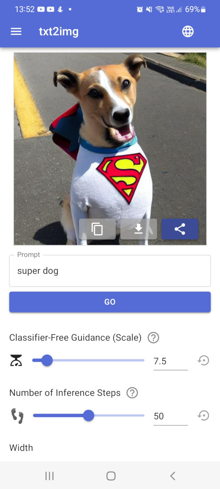

# stable-diffusion-react-nextjs-mui-pwa

_PWA Web App front end for Stable Diffusion, on React/NextJS with Material UI_

Copyright (c) 2022 by Gadi Cohen <dragon@wastelands.net>. MIT Licensed.

<span style="font-size: larger;">
  <a href="https://kiri.art/">kiri.art</a>
</span>

## New Project in Active Development (since Aug 31st, 2022)



- Web interface to run Stable Diffusion queries on:
  - Local PC / local installation
  - [Banana.dev](https://banana.dev) serverless GPU containers (roughly $1 = 200 requests, YMMV)
  - Local banana.dev docker container (see [docs/banana-local.md](./docs/banana-local.md))
  - Others?

Why? Make this fun stuff more accessible to web developers and friends :) See the [live demo](https://kiri.art/), run on your own PC for free, or deploy!

If you have a background in web dev / dev ops, and have wanted to experiment a bit with machine learning / latent diffusion (AI image generation), this is a great project to get involved in :)

Doing this in my very limited spare time, PRs more likely to get responses than issues, but try me :)

## To Develop

1. Clone repo
1. `yarn install`
1. ~~edit `.env.local`~~ (or just set local vars - per below)
1. `yarn dev`

Note: you'll need at least one destination / target from the list below where Stable Diffusion will run.

## Destinations / Targets

- **Local docker image (recommended)**

  - Pretty easy if you have docker installed.
  - See https://github.com/kiri-art/docker-diffusers-api.

- **Local Exec**

  - If you already have Stable Diffusion installed locally,
    this will run the Python script via node spawn.
  - Set `STABLE_DIFFUSION_HOME` (to e.g. `/home/user/src/stable-diffusion`).
  - Works, but not as well maintained as the docker based solutions.

- **Remote BananaDev docker container (serverless GPU)**

  - Great for local dev if you don't have a supported GPU
  - Default for deployments or when `NODE_ENV=="production"`
  - I'm paying roughly $1 = 200 requests with default params, YMMV.
  - Follow instructions at https://github.com/kiri-art/docker-diffusers-api.
  - Set `BANANA_API_KEY` and `BANANA_MODEL_KEY` env variables.
  - Set the relevant keys for your deployed models,
    `BANANA_MODEL_KEY_SD_v1_5` by default.

## REQUIRE_REGISTRATION

By default, registration (i.e. sign up, log in, use credits) is required in production only. You can turn it on in development (to test the auth flow), or turn it off in production (if you're deploying somewhere private).

```bash
REQUIRE_REGISTRATION=1
NEXT_PUBLIC_REQUIRE_REGISTRATION=1
```

Note: `NEXT_PUBLIC_` vars are compiled at build time! So if you want to deploy to production without requiring registration, set it to `0` _before_ building and deploying.

## TODO

- Docker image for super easy start
- Vercel clone button

## i18n

We use NextJS's built-in
[i18n routing](https://nextjs.org/docs/advanced-features/i18n-routing) and
[Lingui](https://lingui.js.org/tutorials/setup-react.html) for translations.

Useful commands:

- `yarn i18n:extract` to extract strings.
- Send `locales/*/messages.po` to translators, resave.
- `yarn i18n:compile` before deploy.

See also [lingui.config.js](./lingui.config.js) and [locales](./locales) dir.

## Refs

- https://github.com/mui/material-ui/tree/master/examples/nextjs-with-typescript
-
