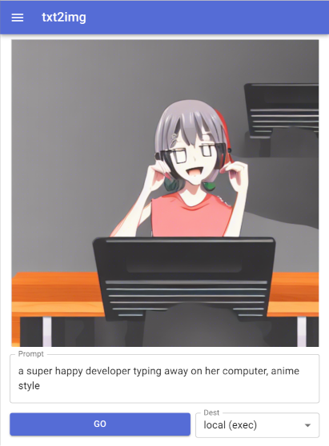

# stable-diffusion-react-nextjs-mui-pwa

_PWA Web App front end for Stable Diffusion, on React/NextJS with Material UI_

Copyright (c) 2022 by Gadi Cohen <dragon@wastelands.net>. MIT Licensed.

## WIP - just started. Only use if you want to help :)

- Web interface to run Stable Diffusion queries on:
  - Local PC / local installation
  - [Banana.dev](https://banana.dev) serverless GPU containers (roughly $1 = 200 requests, YMMV)
  - Others?

Why? Make this fun stuff more accessible to web developers and friends :)

Doing this in my very limited spare time, PRs more likely to get responses that issues, but let's see.

## To Develop

1. Clone repo
1. `yarn install`
1. edit `.env.local`
1. `yarn dev`

## TODO

- Docker image for super easy start
- Vercel clone button

# Banana.dev setup (serverless GPU)

1. Follow instructions at https://github.com/bananaml/serverless-template-stable-diffusion.
2. Set BANANA_API_KEY and BANANA_MODEL_KEY env variables.

## Refs

- https://github.com/mui/material-ui/tree/master/examples/nextjs-with-typescript
